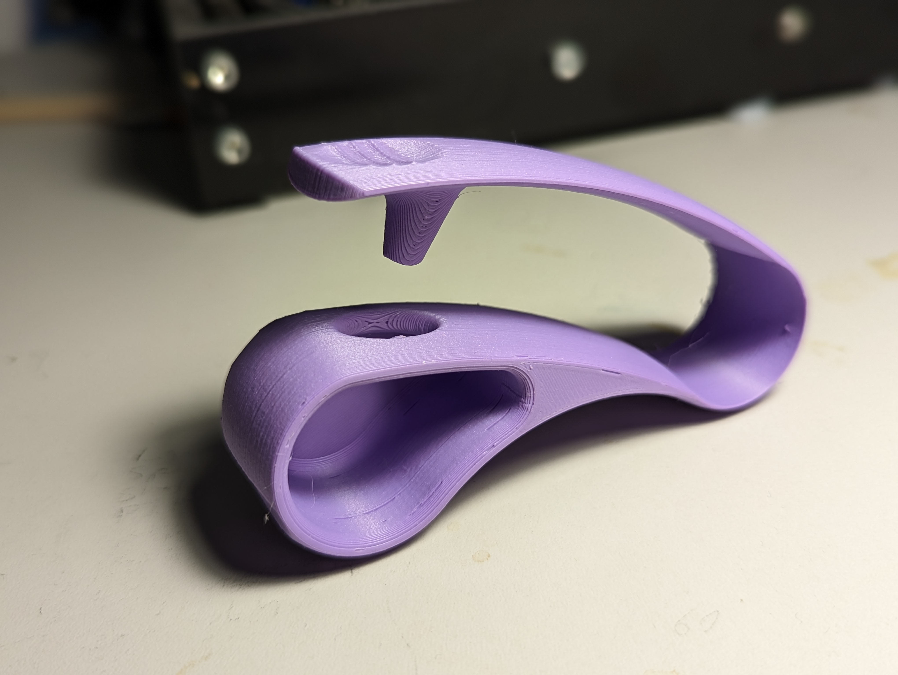

# Blister Pack Opener
The Blister Pack Opener is designed to help users with arthritis or limited hand strength open blister packs of pills.

## More info at
- [Makers Making Change Project Page](https://www.makersmakingchange.com/s/product/blister-pack-opener/01tJR0000009H85YAE)

## How to Obtain a Blister Pack Opener
### 1. Do it Yourself (DIY) or Do it Together (DIT)

This is an open-source assistive technology, so anyone is free to build it. All of the files and instructions required to build the Blister Pack Opener are contained within this repository. Refer to the Maker Checklist below.

### 2. Request a build of this device

If you would like to obtain a Blister Pack Opener, you may submit a build request through the [MMC Library Page](https://www.makersmakingchange.com/s/product/blister-pack-opener/01tJR0000009H85YAE). The requestor is responsible for the cost of materials and any shipping.

### 3. How to build this device for someone else

If you have the skills and equipment to build this device, and would like to donate your time to create the switch for someone who needs it, visit the [MMC Maker Wanted](https://makersmakingchange.com/maker-wanted/) section.

## Getting Started

### 1. Read the Makers Checklist

[The Makers Checklist](/Documentation/Blister_Pack_Opener_Maker_Checklist_V1.0.pdf)

### 2. Order the Off-The-Shelf Components

The [Bill of Materials](/Documentation/Blister_Pack_Opener_BOM_V1.0.xlsx) lists all of the parts and components required to build the Blister Pack Opener. 

### 3. Print the 3D Printable components

All of the files and individual print files can be in the [/Build_Files/3D_Printing_Files](/Build_Files/3D_Printing_Files/) folder.

## Files
### Documentation
| Document             | Version | Link |
|----------------------|---------|------|
| Design Rationale     | 1.0     | [Blister_Pack_Opener_Design_Rationale](/Documentation/Blister_Pack_Opener_Design_Rationale_V1.0.pdf)     |
| Maker Checklist      | 1.0     | [Blister_Pack_Opener_Maker_Checklist](/Documentation/Blister_Pack_Opener_Maker_Checklist_V1.0.pdf)     |
| Bill of Materials    | 1.0     | [Blister_Pack_Opener_Bill_of_Materials](/Documentation/Blister_Pack_Opener_BOM_V1.0.xlsx)     |
| 3D Printing Guide    | 1.0     | [Blister_Pack_Opener_3D_Printing_Guide](/Documentation/Blister_Pack_Opener_3D_Printing_Guide_V1.0.pdf)     |
| Assembly Guide       | 1.0     | [Blister_Pack_Opener_Assembly_Guide](/Documentation/Blister_Pack_Opener_Assembly_Guide_V1.0.pdf)     |
| User Guide           | 1.0     | [Blister_Pack_Opener_User_Guide](/Documentation/Blister_Pack_Opener_User_Guide_V1.0.pdf)    |
| Changelog            | 1.0     | [Blister_Pack_Opener_Changelog](/Documentation/Blister_Pack_Opener_Changelog_V1.0.pdf)     |

### Design Files
 - [CAD Files](/Design_Files/CAD_Files)

### Build Files
 - [3D Printing Files](/Build_Files/3D_Printing_Files)

## Attribution

Designers:
 - Design and documentation by Neil Squire Society/Makers Making Change

## License
Everything needed or used to design, make, test, or prepare the Blister Pack Opener is licensed under the [Attribution-NonCommercial-ShareAlike 4.0 ](https://creativecommons.org/licenses/by-nc-sa/4.0/).

Accompanying material such as instruction manuals, videos, and other copyrightable works that are useful but not necessary to design, make, test, or prepare the Blister Pack Opener are published under a Creative Commons Attribution-ShareAlike 4.0 license https://creativecommons.org/licenses/by-sa/4.0/ (CC BY-SA 4.0).

---

<!-- ABOUT MMC START -->
## About Makers Making Change

Makers Making Change is a program of [Neil Squire](https://www.neilsquire.ca/), a Canadian non-profit that uses technology, knowledge, and passion to empower people with disabilities.

Makers Making Change leverages the capacity of community based Makers, Disability Professionals and Volunteers to develop and deliver affordable Open Source Assistive Technologies.

 - Website: [www.MakersMakingChange.com](https://www.makersmakingchange.com/)
 - GitHub: [makersmakingchange](https://github.com/makersmakingchange)
 - Bluesky: [@makersmakingchange.bsky.social](https://bsky.app/profile/makersmakingchange.bsky.social)
 - Instagram: [@makersmakingchange](https://www.instagram.com/makersmakingchange)
 - Facebook: [makersmakechange](https://www.facebook.com/makersmakechange)
 - LinkedIn: [Neil Squire Society](https://www.linkedin.com/company/neil-squire-society/)
 - Thingiverse: [makersmakingchange](https://www.thingiverse.com/makersmakingchange/about)
 - Printables: [MakersMakingChange](https://www.printables.com/@MakersMakingChange)

### Contact Us
For technical questions, to get involved, or to share your experience we encourage you to [visit our website](https://www.makersmakingchange.com/) or [contact us](https://www.makersmakingchange.com/s/contact).
<!-- ABOUT MMC END -->
